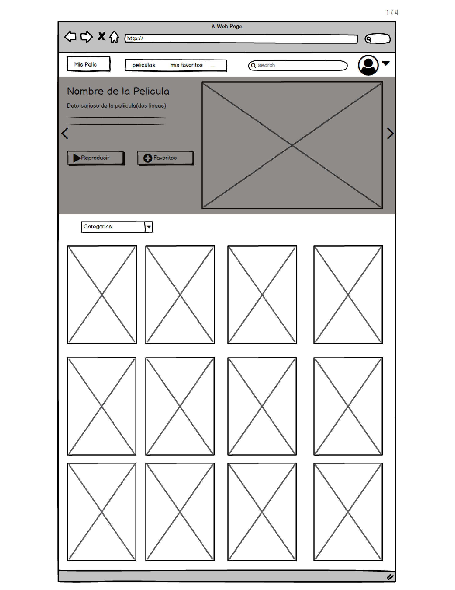
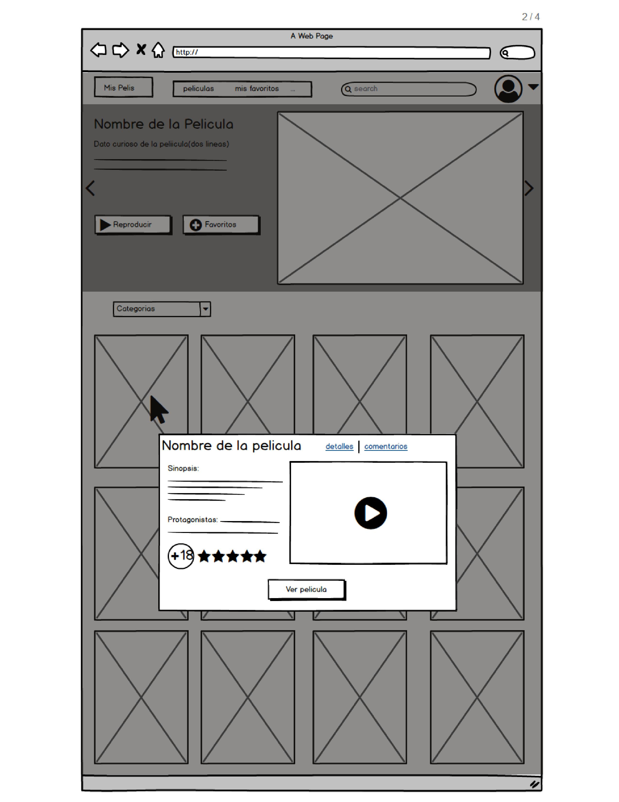
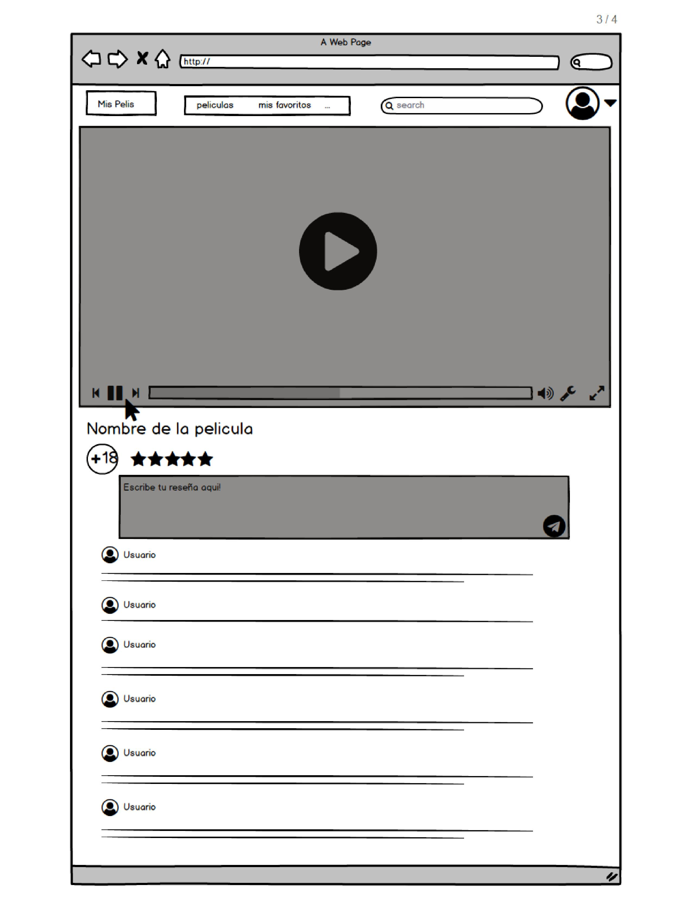
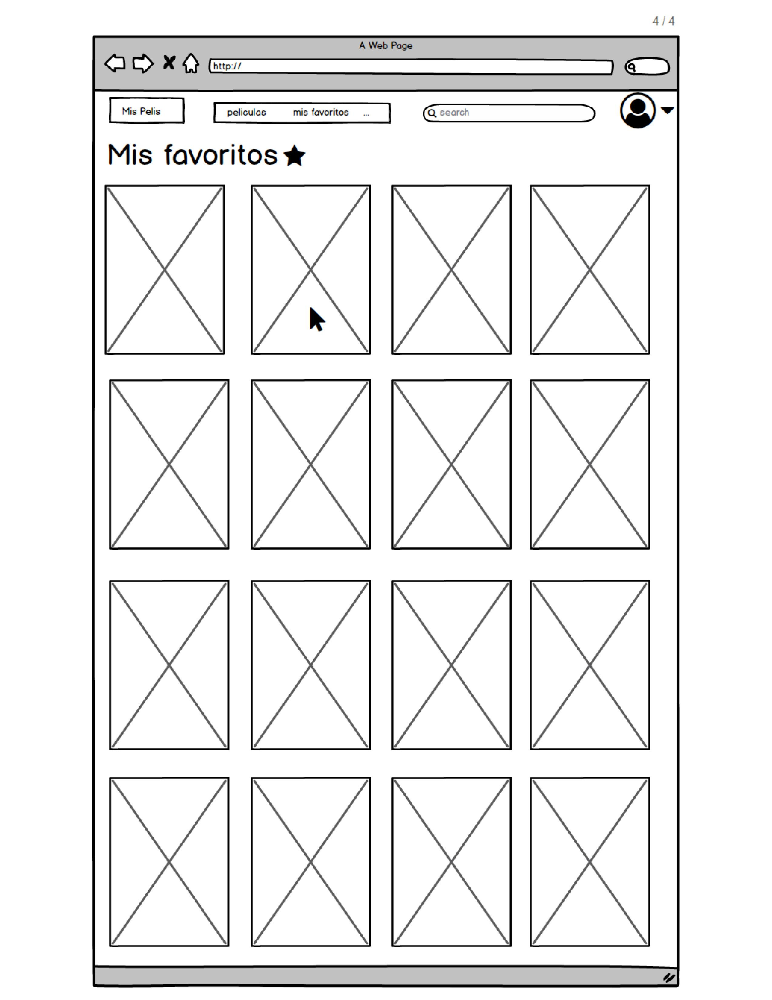

# ***Challenge Hackathon***
*Bienvenida a la hackathon de finalización del plan común. En esta ocasión la temática será el consumo de películas y para ello crearemos soluciones/productos utilizando el API de Open Movie Database (OMDB) o the movie database .

# ***BlockBuster***

* BlockBuster es una pagina web que se enfoca en peliculas familiares con el fin de propiciar espacios de encuentro, reflexion y diversion entre las familias.

## *Proceso de eleccion del producto*

* Nos decidimos por una pagina web, por que al entrevistar a los usuarios nos dimos cuenta que sus necesidades no han sido completamente satisfechas. Ya que existen muchas paginas web pero ninguna cumple con su objetivo, tienen problemas como baja resolucion, audio mal grabado y con contenido desactualizado.

* Al momento de hacer las entrevistas nos dimos cuenta de que la mayoria de paginas web, no tienen mucho contenido para familias.

* El tiempo de escoger y decidir que pelicula ver en familia, es tiempo muerto, debido al gusto de cada uno de los integrantes.

## *Investigacion:*

 1. Se revisaron paginas web de peliculas online.
 2. Se aplicaron las 5 fases de Design Thinking.
 3. Se plantearon problemas y preguntas.
 4. Entrevistas a usuarios.

## *Organizacion:*
* https://trello.com/b/nPpGR8Y9/team-hackaton

## *Avance:*
* 

## *Protoripado del producto terminado*

